# FieldFlow – Wireframe Evidence

## 1. Overview

This document records the initial low-fidelity wireframes prepared during Week 1 of the FieldFlow internship project.

The purpose of these wireframes is to define the main application screens, user navigation, page responsibilities, and role-based interfaces before starting detailed application development.

FieldFlow is a Field Service Management System with three main user roles:

* Administrator
* Dispatcher
* Technician

The wireframes focus on the mandatory core areas of the system:

1. Authentication
2. Role-based access
3. Customers
4. Technicians
5. Work Orders
6. Dashboard

## 2. Figma Design

The editable FieldFlow wireframes are available in Figma:

[Open FieldFlow Wireframes in Figma](https://www.figma.com/design/8l4FP2yt7rnBjoh6ePI3oU/FieldFlow-Wireframes?node-id=38-207&t=6eWsG2RFer4Ll2Zg-0)

> The Figma file contains the complete initial set of FieldFlow application wireframes created during Week 1.

## 3. Wireframe List

The following wireframes were created:

1. Login
2. Admin Dashboard
3. Users
4. Customers
5. Customer Details
6. Technicians
7. Technician Details
8. Work Orders
9. New Work Order
10. Work Order Details
11. My Jobs

## 4. Wireframe Details

### 4.1 Login

**Frame:** `01 - Login`

**Users:** Administrator, Dispatcher, Technician

The Login screen provides the common authentication entry point for all FieldFlow users.

Main elements:

* FieldFlow application name
* Field Service Management System description
* Email field
* Password field
* Sign In button
* Invalid login message area
* System image/illustration placeholder

After successful authentication, the application will display the appropriate workspace according to the user's role.

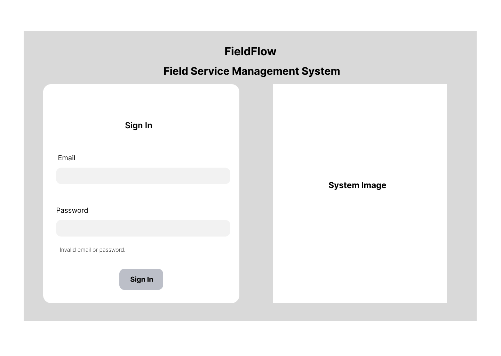

### 4.2 Admin Dashboard

**Frame:** `02 - Admin Dashboard`

**User:** Administrator

The Admin Dashboard provides a high-level view of FieldFlow operations.

Main elements:

* Admin identification and Sign Out
* Dashboard navigation
* Customers navigation
* Technicians navigation
* Work Orders navigation
* Users navigation
* Open Jobs count
* Assigned Jobs count
* Completed Jobs count
* Available Technicians count
* Busy Technicians count
* Recent Work Orders
* Quick actions for creating records

The Users menu is an Administrator-only area.

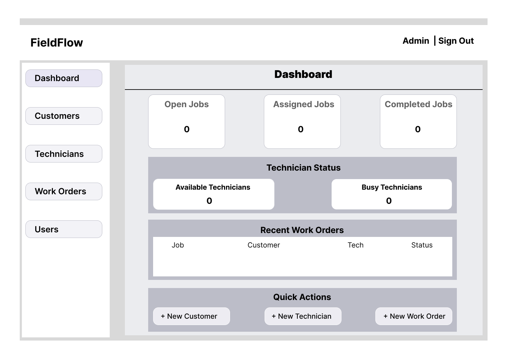

### 4.3 Users

**Frame:** `03 - Users`

**User:** Administrator

The Users page is used to manage system user accounts and roles.

Main elements:

* Search users
* Add User action
* User name
* Email
* Role
* Status
* Edit action

The Dispatcher and Technician roles will not have access to this management area.

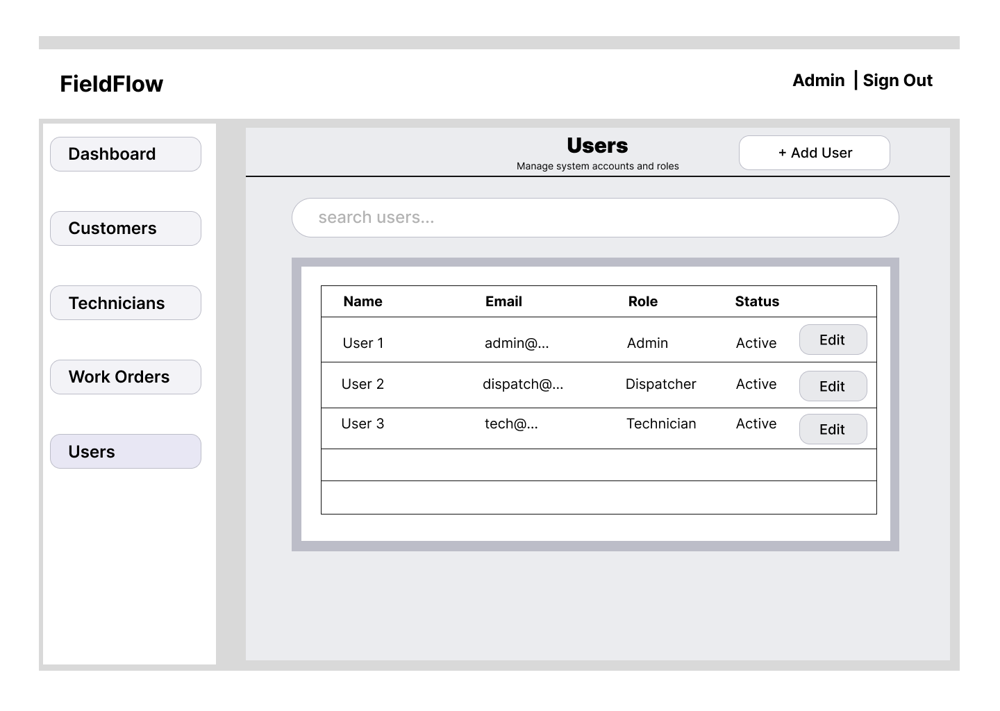

### 4.4 Customers

**Frame:** `04 - Customers`

**Users:** Administrator, Dispatcher

The Customers page is used to find and manage customer records.

Main elements:

* Search customers
* Add Customer action
* Customer name
* Email
* Phone
* Address
* View action
* Edit action

Customer records will later be connected to their related work orders.

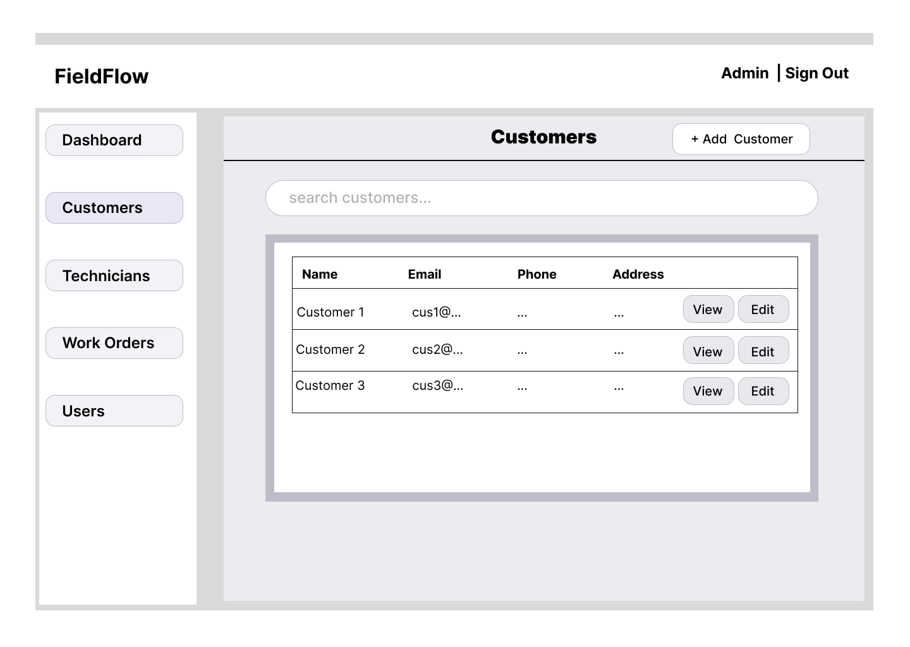

### 4.5 Customer Details

**Frame:** `05 - Customer Details`

**Users:** Administrator, Dispatcher

The Customer Details page displays information about one selected customer.

Main elements:

* Customer name
* Email
* Phone
* Address
* Edit Customer action
* Related Work Orders section
* Technician assigned to related jobs
* Work-order status

This page allows customer information and service history to be viewed together.

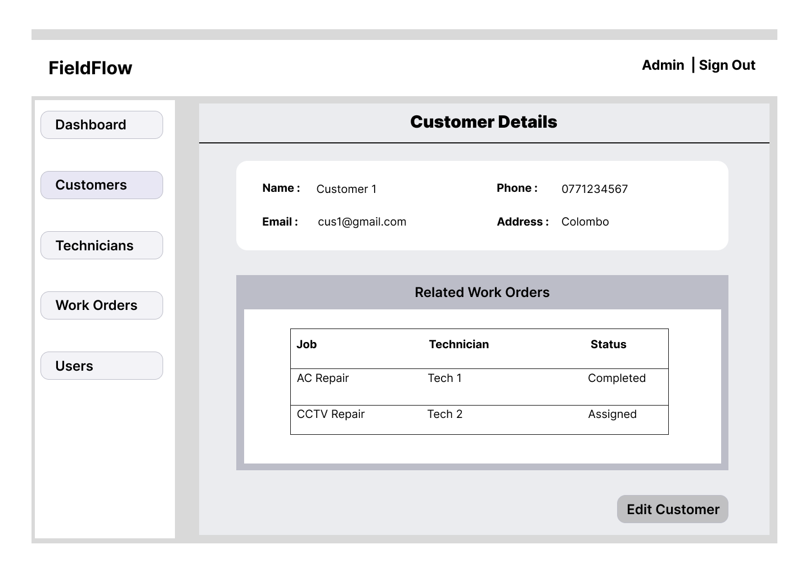

### 4.6 Technicians

**Frame:** `06 - Technicians`

**Users:** Administrator, Dispatcher

The Technicians page is used to manage technician profiles and availability.

Main elements:

* Search technicians
* Filter by skill
* Filter by status
* Add Technician action
* Technician name
* Email
* Phone
* Skills
* Status
* View action
* Edit action

Technician statuses include information such as availability or whether the technician is currently busy.

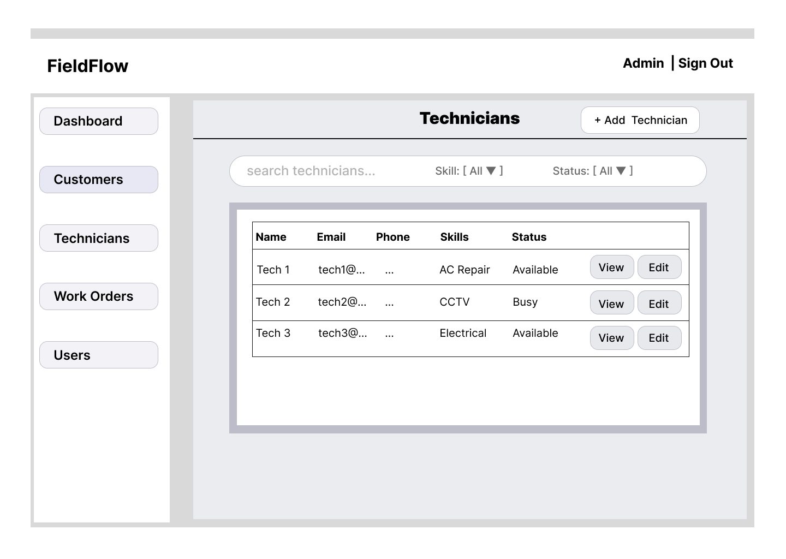

### 4.7 Technician Details

**Frame:** `07 - Technician Details`

**Users:** Administrator, Dispatcher

The Technician Details page displays information about one technician.

Main elements:

* Technician name
* Email
* Phone
* Skills
* Status
* Linked user account
* Assigned Work Orders
* Customer associated with each job
* Work-order status
* Edit Technician action

Each Technician profile will eventually be linked to the user's login account.

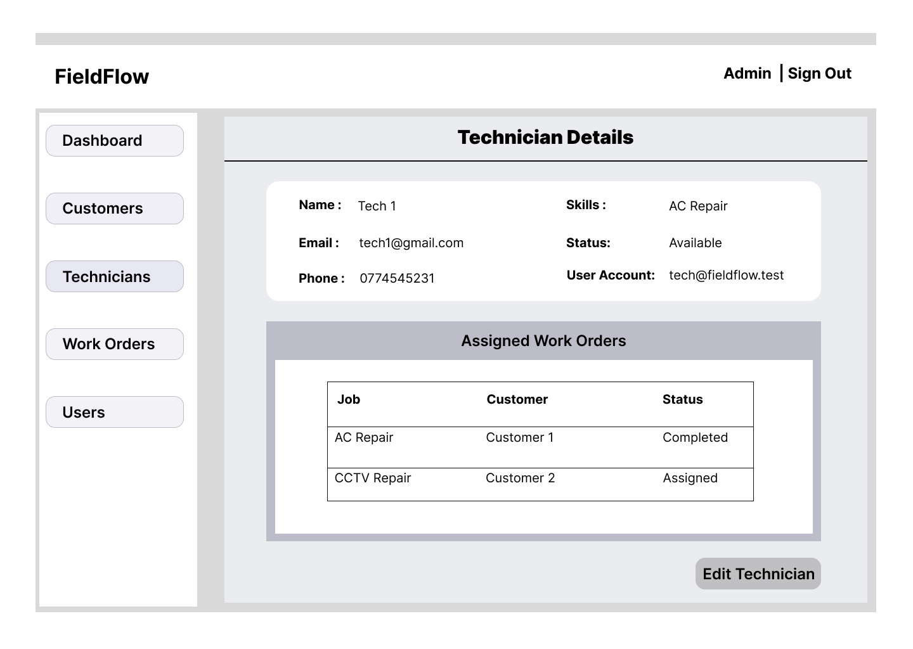

### 4.8 Work Orders

**Frame:** `08 - Work Orders`

**Users:** Administrator, Dispatcher

The Work Orders page provides the main management view for service jobs.

Main elements:

* Search work orders
* Filter by status
* Filter by priority
* Filter by technician
* Add Work Order action
* Title
* Customer
* Assigned Technician
* Priority
* Status
* Scheduled Date and Time
* View action
* Edit action

Work Orders are the central feature connecting customers, technicians, assignments, job status, and service progress.

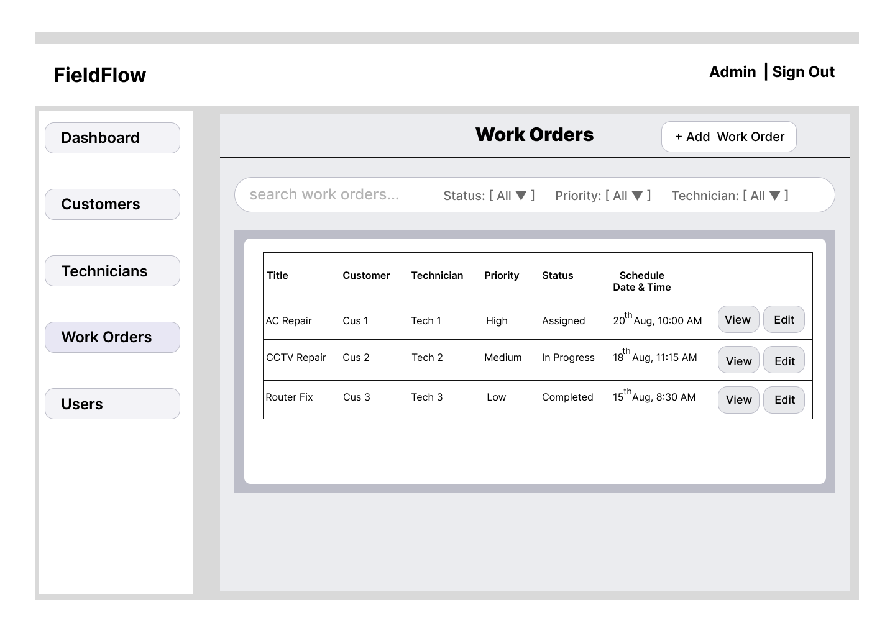

### 4.9 New Work Order

**Frame:** `09 - New Work Order`

**Users:** Administrator, Dispatcher

The New Work Order screen is used to create a service job.

Main elements:

* Title
* Description
* Customer selection
* Technician selection
* Priority selection
* Scheduled Date
* Scheduled Time
* System-controlled initial status
* Cancel action
* Create Work Order action

The initial status is controlled by the application workflow rather than being freely selected by the user.

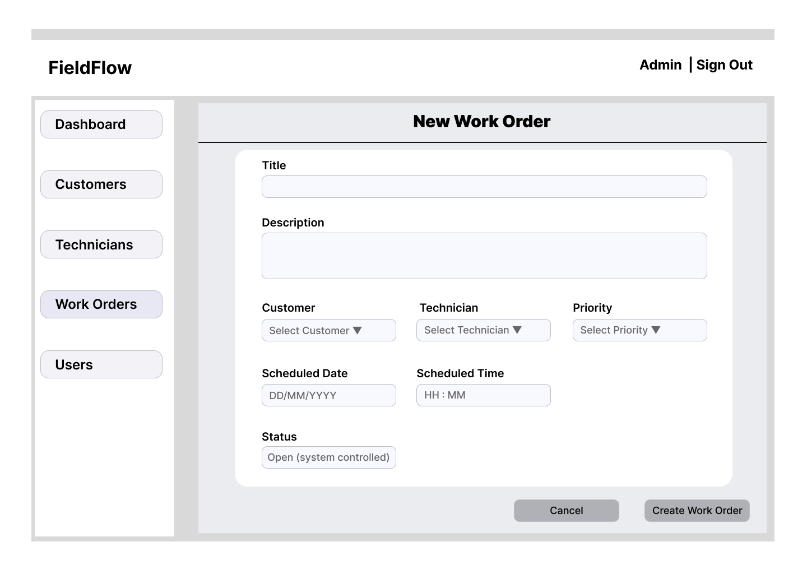

### 4.10 Work Order Details

**Frame:** `10 - Work Order Details`

**Users:** Administrator, Dispatcher, and Technician according to access rules

This page displays detailed information about a selected Work Order.

Main elements:

* Work-order title
* Status
* Priority
* Customer
* Assigned Technician
* Scheduled Date
* Scheduled Time
* Description
* Activity and Progress History
* Completion Notes
* Edit Work Order action
* Reassign Technician action for authorised management roles

The Activity and Progress History area is intended to show who performed an update and when it happened.

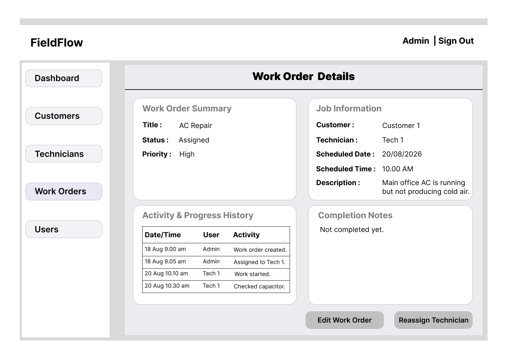

### 4.11 My Jobs

**Frame:** `11 - My Jobs`

**User:** Technician

My Jobs is the Technician's main workspace.

Main elements:

* Technician identification and Sign Out
* Assigned Jobs count
* In Progress Jobs count
* Completed Jobs count
* Job title
* Customer
* Priority
* Status
* Scheduled Date and Time
* View Job action

Only Work Orders assigned to the signed-in Technician should be displayed in this workspace.

The Technician will later use the Work Order Details screen to start work, add progress information, enter completion notes, and complete an assigned job.

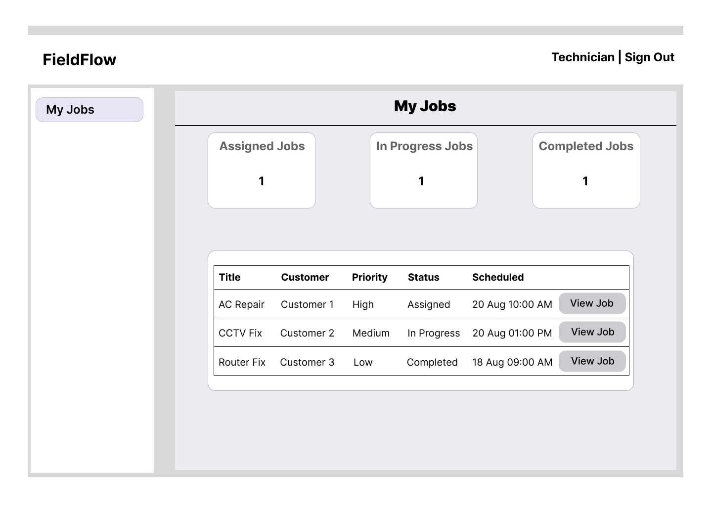

## 5. Role-Based Interface Decisions

### Administrator

The Administrator can access:

* Dashboard
* Users
* Customers
* Technicians
* Work Orders

The Administrator has the highest level of system access.

### Dispatcher

The Dispatcher will use a similar management interface but will not have access to the Users management page.

The Dispatcher mainly works with:

* Dashboard
* Customers
* Technicians
* Work Orders

### Technician

The Technician uses a restricted workspace focused on:

* My Jobs
* Assigned Work Order Details
* Work progress
* Completion information

The Technician must not be able to view another Technician's assigned jobs.

## 6. Main Workflow Represented by the Wireframes

The wireframes support the following core FieldFlow workflow:

1. An Administrator or Dispatcher signs in.
2. A customer record is created or selected.
3. A technician record is created or selected.
4. A Work Order is created.
5. A Technician is assigned to the Work Order.
6. The Technician signs in.
7. The assigned Work Order appears in My Jobs.
8. The Technician starts the job.
9. Progress information is recorded.
10. Completion notes are entered.
11. The job is completed.
12. Work-order history and dashboard information are updated from saved system data.

## 7. Design Scope

These are low-fidelity Week 1 wireframes.

Their purpose is to define:

* Page structure
* Navigation
* Required information
* User actions
* Role-based access
* Main system workflow

They are not intended to represent the final visual design.

Colours, typography, responsive behaviour, polished components, loading states, validation styling, and final user-interface details will be improved during later development stages.

## 8. Week 1 Evidence Status

The following wireframe evidence has been prepared:

* Figma design file
* 11 main application wireframes
* Exported PNG screenshots
* Role-based navigation design
* Core workflow representation
* Wireframe documentation stored in the Git repository

This document forms part of the Week 1 planning and design evidence for the FieldFlow internship project.
